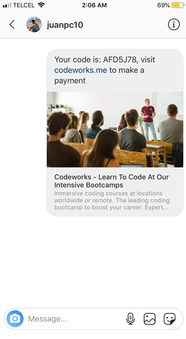
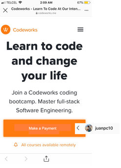
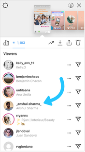
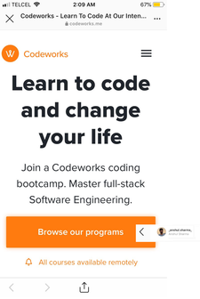
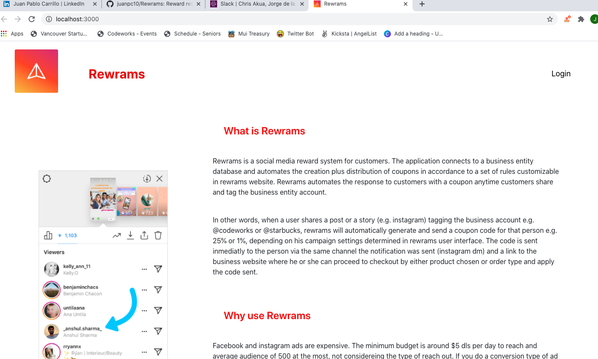
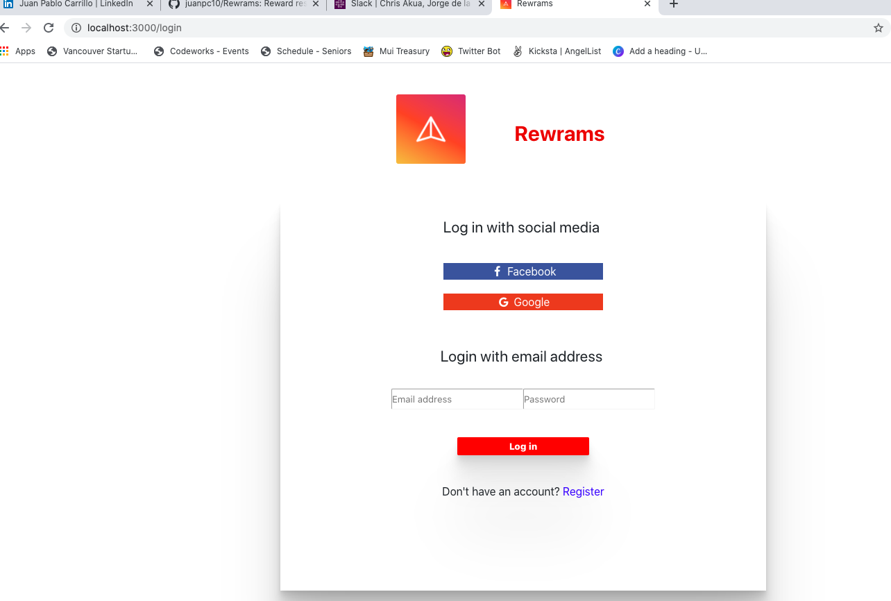
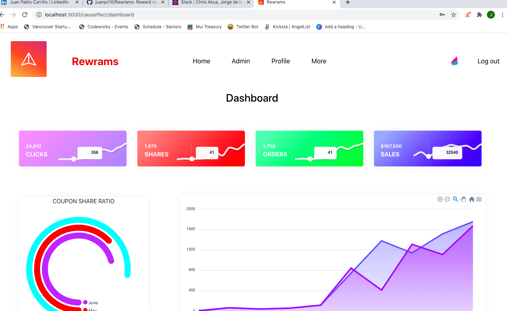
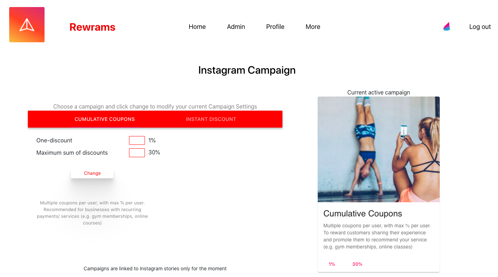
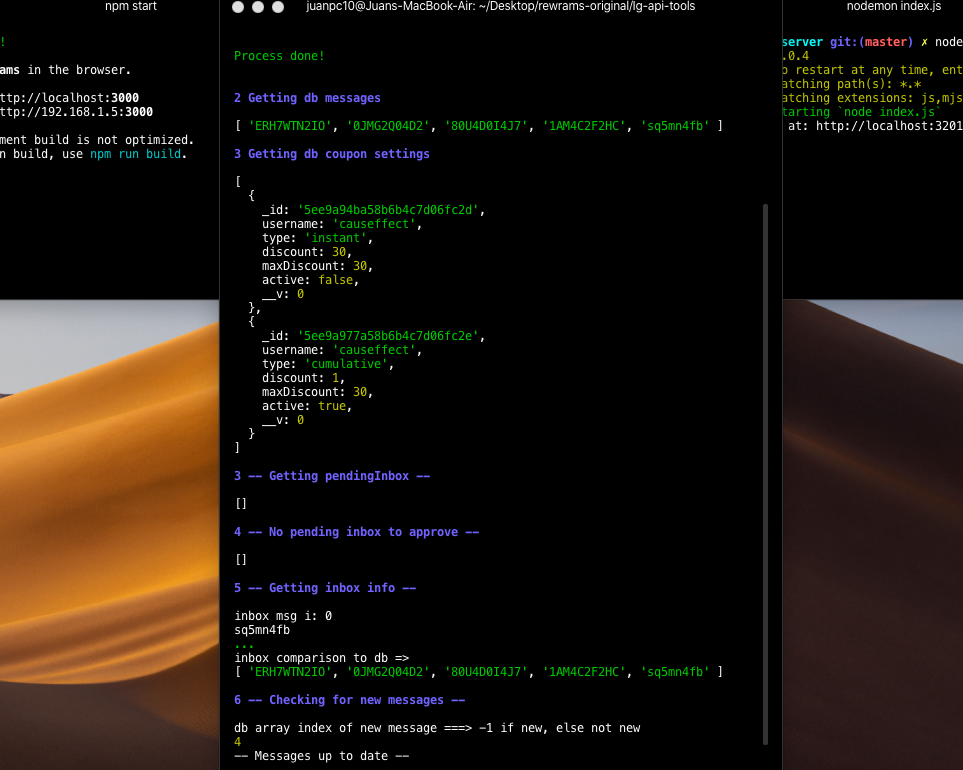

# Rewrams

Rewarding customers

Rewrams is a social media reward system for customers. The application connects to a business entity database
and automates the creation plus distribution of coupons in accordance to a set of rules customizable in rewrams web application.
Rewrams automates the response to customers with a coupon anytime customers share and tag the business entity account.

  

In simple words, anytime a customer uploads a story in Instagram and tags a business account, the customer receives a coupon, a coupon with a percentage already establised in Rewrams application.

As of now, the application is fully functional with instagram stories but a coupon can be awarded to posts, hashtags, or commentaries as well, if needed by the customer. The application dynamics can also be applied to other social media platforms as well.

Here is a quick representation of how it works:

1. Customer shares story.

  

2. Customer receives a dicount code.

  

3. Customer pays with the discount rewarded.

  

4. Customer's friend gets interested in codeworks.

  

5. Customer's friend signs up to codeworks.

  

# User Interface

1. Home sign out

  

2. Sign In

  

3. Home dashboard

  

4. Campaign settings

  

5. Reply automation

  

## Context

Facebook and instagram ads are expensive. The minimum budget is around $5 dls per day to reach and average audience of 500 at the most,not considereing the type of reach out. If you do a conversion type of ad and you track the conversion with a pixel,
on average, if succesful, you get a conversion after a week or so when the pixel is maturing and facebook is optimizing
the audience to reach. This could translate to $35 dls per week for 1 conversion per week, then you can scale up and so.
This may not seem as much but it totals a $155 dls per month, for around 1 possible conversion considering a targeted niche generic product (e.g. $50 bluetooth speaker).
Fb in collaboration with instagram takes time to understand and optimize the targeting of your audience. Considering you test a certain type of ad (e.g. click type), and a certain type of audience (e.g. young adults age 18-25 with interests in music and have liked spotify,etc.), each test can cost the said amount mentioned, $155/month. The marketing cost can easily increase without having many results (e.g. $155dls/month for each of the 4 to 5 tests = -$620 for selling 1 to 3 $50 speakers).

You can reach the same outcome by using your clients social media. When you have a sale, the client is the target audience
and as the group he engages is likely to be similar to him in terms of demographics and interests, therefore we can conclude
his social media group is to some extent your target audience as well. Allowing him to share his experience
is allowing you to advertise to the target audience you need, similar to facebook figuring out what target audience to advertise.
The difference is you can determine the price and you are also giving the benefit to the client.

## Demo

- Deployment in process.
- Video: https://www.youtube.com/watch?v=eCE9CJVE7T0&feature=youtu.be

## Getting started

- To run the project you will need Git, Node, mongodb, mongoose, and npm installed.

## Installation

1. Clone the repository.
2. Run `npm install` in the client root folder.
3. Run `npm start` in your client root folder.
4. Run `brew services start mongodb-community` for mac users, for windows and other users check [documentation](https://docs.mongodb.com/manual/tutorial/manage-mongodb-processes/)
5. Run `npm install` in the coupons-server root folder.
6. Run `nodemon index.js` in the coupons-server folder.
7. Run `npm install` in the users-server folder.
8. Run `npm run server` in the users-server folder.

The instagram reply automatization is run in a separate folder which I have not uploaded. Reach me out if you would like to implement this feature.

## Environment variables

Create a .env file in the **users-server** folder with the following variables:

- db

* MONGO_URI_DEV=
* MONGO_URI_PROD=

- google

* GOOGLE_CLIENT_ID=
* GOOGLE_CLIENT_SECRET=
* GOOGLE_CALLBACK_URL=

- facebook

* FACEBOOK_APP_ID=
* FACEBOOK_SECRET=
* FACEBOOK_CALLBACK_URL=

- jwt

* JWT_SECRET_DEV=
* JWT_SECRET_PROD=

- site urls

* CLIENT_URL_DEV=
* CLIENT_URL_PROD=
* SERVER_URL_DEV=
* SERVER_URL_PROD=

- img folder path

* IMAGES_FOLDER_PATH=/public/images/

## Built with

- [MongoDb](https://www.mongodb.com/) - Application databases.
- [Mongoose](https://mongoosejs.com/) - Object document modeling (ODM) layer that sits on top of the Node.Js, and MongoDB API.
- [Express](https://expressjs.com/) - Framework layered on top of NodeJS, used to build the backend.
- [React](https://reactjs.org/) - Front end library for building user interfaces.
- [Node.js](https://nodejs.org/) - JavaScript runtime environment.
- [Material UI](https://ant.design/) - A design system for enterprise-level products.
